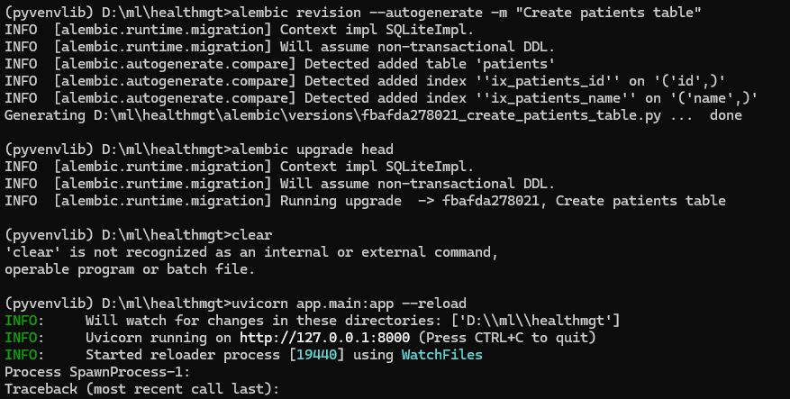

# Health Manament System 
Sample For API Development POC Project MVC Architecture Design

## Python Libray Package install

```Create Vertual Environment
 python -m venv myenvlib

 c:>myenvlib\Script\activate
 
 (myenvlib) c:>healthmgmt>

```

``` Instalation 
pip install "fastapi[standard]"
pip install SQLAlchemy
pip install alembic

```
### FastAPI

Fastapi is a modern, fast (high-performance), web framework for building APIs and also generating api docs automatically. It is built on top of standard Python type hints and supports asynchronous programming.
### SQLAlchemy
SQLAlchemy is a SQL toolkit and Object-Relational Mapping (ORM) library for Python. It help us to interact with the database using python code. It provides a high-level interface for working with databases.

### Alembic
Alembic is a lightweight migration tool for SQLAlchemy. It helps us to manage the database schema changes.

### Project Structure


### database Migration and Run Apps


OR

### Run Application
```
 uvicorn app.main:app --reload
 or
 
 fastapi dev main.py

```